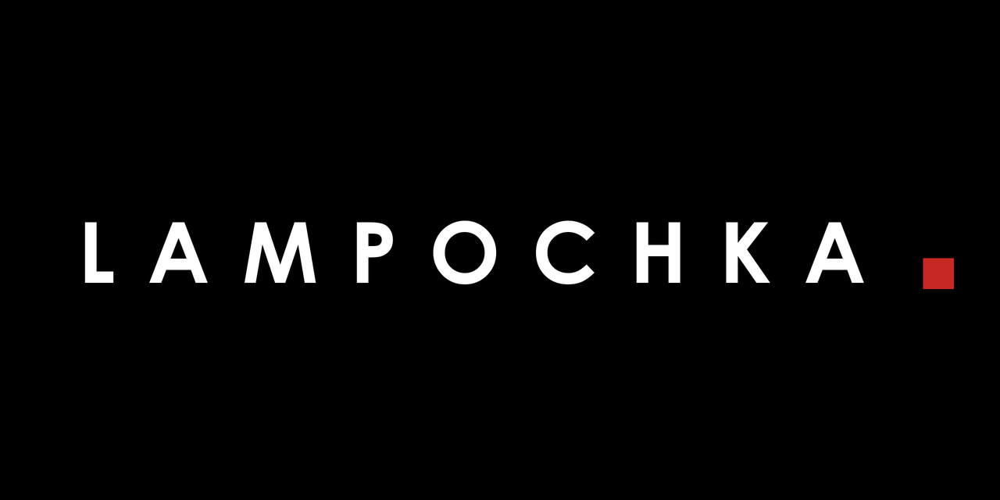
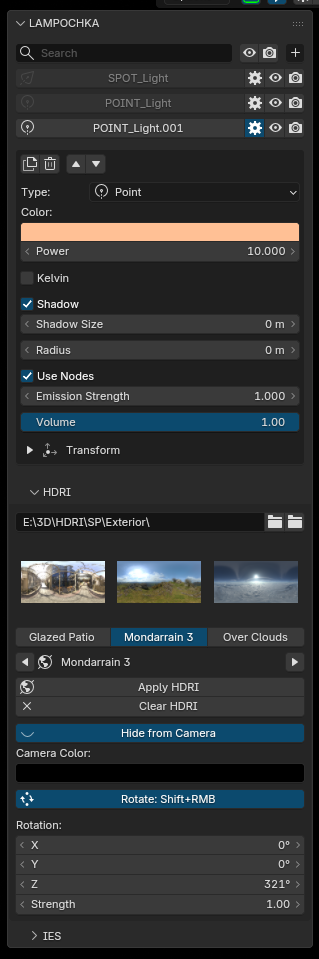

# LAMPOCHKA



Blender addon for managing all lights in the scene from a single panel — plus an HDRI environment browser.

**Blender 3.6+ / 4.2+ · Author: Maksim Kovalev**

---

Instead of searching for lights in the Outliner or switching between objects, you get a dedicated panel with instant access to every light's settings — color, power, shadow, type-specific parameters, and transforms.

## Features

### Light List
- All scene lights displayed with type icons (Point / Sun / Spot / Area)
- Filter by name
- Click to select in viewport
- Gear icon (⚙) opens inline settings

### Visibility Controls
- 👁 — toggle viewport visibility per light
- 📷 — toggle render visibility per light
- ✕ — delete the light right from the row (Ctrl+Z friendly)
- Global toggle all visibility / render from header

### Inline Settings (via ⚙)
- Light type, color, power
- **Kelvin temperature (v2.3)** — toggle drives light color from blackbody temperature (1500–12000 K slider); the original color is remembered and restored on toggle off. Node lights (e.g. with an IES profile) are driven through a Blackbody node instead. Works in Cycles and EEVEE
- Shadow toggle + shadow size
- **Point** — radius
- **Sun** — angle
- **Spot** — size, blend, show cone
- **Area** — shape, size X/Y
- **Cycles** — use nodes, emission strength
- Contact shadow (distance, bias, thickness)
- Volume factor
- Transform (collapsed by default): location, rotation, scale

### Light Management
- Add light (Point / Sun / Spot / Area) from header menu
- Duplicate / Delete buttons in settings
- Move up / down in list

### Viewport Sync
- Selecting a light in the viewport automatically highlights it in the panel
- Selecting a light in the panel selects it in the viewport
- Settings state transfers when switching between lights:
  - If settings were open → they open for the new light
  - If settings were closed → they stay closed

### HDRI Browser (v2.1)
- Collapsible **HDRI** sub-panel below the light list
- Pick a folder — all `.exr` / `.hdr` files appear as a thumbnail grid
- **Preview carousel (v2.4)** — one compact row of three cards (previous / active / next) with large previews; flip through the folder with the arrows, click a card to apply instantly
- **Prev / Next arrows (v2.4)** — flip through the folder and apply each HDRI instantly, no need to hit Apply every time
- **Apply HDRI** — builds the world node setup (TexCoord → Mapping → Environment → Background) in one click
- If the world already has an environment setup, only the image is swapped — existing nodes are not destroyed
- **Hide from Camera (v2.4)** — show a flat color to the camera instead of the HDRI (black by default) while lighting and reflections keep the HDRI; classic VFX trick for rendering on a clean plate
- **Clear HDRI** — removes the HDRI node chain and leaves a plain Background (strength 1); rotation and strength reset in the panel
- **Rotation** — rotate the environment (Z for turntable-style spin, X/Y for tilt)
- **Strength** — environment intensity, live update
- **Rotate: Shift+RMB** — toggle; when enabled, drag with **Shift + Right Mouse** in the viewport to spin the HDRI around Z. Ctrl+Z undoes the whole drag. The toggle is always off in a fresh session (resets on every file load) so the default navigation is never hijacked unexpectedly
- Rotation and strength apply to the HDRI node setup even after re-applying a different HDRI
- **Remembered folder** — the last picked HDRI folder is stored in add-on preferences and auto-filled in every new project; an individual `.blend` can still override it with its own folder

#### Where is the remembered folder stored?
`Preferences → Add-ons / Get Extensions → LAMPOCHKA → Default HDRI Folder`.
Picking a folder in the panel updates it automatically; you can also edit it there manually.

### Sun (v2.5)
- Collapsible **Sun** sub-panel: aim any sun light by time of day, date and location
- Time / date / latitude / longitude / UTC offset / north offset / distance
- Presets: **Noon**, **Golden Hour** (one hour before sunset), **Sunset**
- Read-out of elevation, azimuth, sunrise and sunset times
- **Day animation**: keyframe the *Time* property — the sun follows every frame (paused during renders/bakes)
- Solar position computed with the public-domain NOAA algorithm

### IES Browser (v2.3)
- Collapsible **IES** sub-panel below the light list
- Pick a folder — all `.ies` files appear as a grid (thumbnails are picked up from a `thumbnails/` subfolder if present, like `thumbnails/<name>.jpg`)
- **Apply IES** — builds the IES node setup on the **active light** (Point or Spot): `IES → Emission → Output`
- If the light already has the LAMPOCHKA IES setup, only the file is swapped; if it has an Emission chain, the IES node is inserted without destroying nodes
- **Remove IES** strips the IES node from the active light
- IES profiles work in **Cycles only** (the panel warns when another engine is active)
- The last picked folder is remembered in preferences, same as HDRI

## Installation

### Ready-to-use archives
- `lampochka_legacy.zip` — for Blender 3.6+
- `lampochka_extension.zip` — for Blender 4.2+

### Legacy (Blender 3.6+)
1. `Edit → Preferences → Add-ons → Install`
2. Select `lampochka_legacy.zip`
3. Enable "LAMPOCHKA"

### Extension (Blender 4.2+)
1. `Edit → Preferences → Get Extensions`
2. ⚙ → `Install from Disk...`
3. Select `lampochka_extension.zip`

## Usage

`View3D → Sidebar (N) → LAMPOCHKA`



## Project Structure

```
LAMPOCHKA/
├── out/                       ← distributives (this folder)
│   ├── README.md
│   ├── lampochka_legacy.zip
│   └── lampochka_extension.zip
└── work/                      ← sources (git repo)
    ├── extension/
    │   ├── __init__.py
    │   └── blender_manifest.toml
    ├── legacy/
    │   └── lampochka/
    │       └── __init__.py
    └── screen/
```

## Requirements

Blender 3.6+ (legacy) or 4.2+ (extension)

## Credits

- Inspired by the **Lumio** add-on (The Blenderender) — HDRI browser concept

## Author

Maksim Kovalev


---

## 🔗 Related Tools

| Tool | Description |
|------|-------------|
| [STUKACH](https://github.com/abyrvalg379/STUKACH) | Pipeline asset validator for Blender |
| [LAMPOCHKA](https://github.com/abyrvalg379/LAMPOCHKA) | Scene light manager |
| [Switch_UDIM](https://github.com/abyrvalg379/Switch_UDIM) | Single ↔ UDIM texture switcher |
| [FLOMASTER](https://github.com/abyrvalg379/FLOMASTER) | OCIO launcher for DCC apps |
| [FILTER](https://github.com/abyrvalg379/FILTER) | Toggle visibility/selection by type, name, collection |
